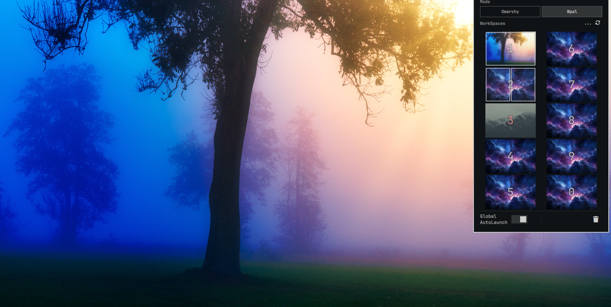

# Wpal

Per-workspace background (default, custom, or random) and auto-launched
pane layouts for empty workspaces — an [Omarchy](https://omarchy.org) bar
plugin.



## Install

```bash
omarchy plugin add https://github.com/SilverStoneSecure/Wpal.git --enable
```

- **id**: `silverstone.wpal`
- **kinds**: `service`, `bar-widget`
- **license**: MIT

## What it does

Click the bar icon to open the panel: a strip of ten workspace cards, one
per workspace. Click a card to configure that workspace:

- **Background** — Default (the current Omarchy theme wallpaper), a custom
  image, or Random from a pool folder (or an http(s) URL, fetched once into
  a local cache).
- **Auto-launch panes** — up to four apps/webapps/terminals/commands that
  open automatically, in a fixed tiled layout, the first time you land on
  that workspace while it's empty.
- **Clone** a workspace's whole setup onto another one.

Settings live in the plugin's own entry in `~/.config/omarchy/shell.json`
(`bar.layout.right`, id `silverstone.wpal`) — the same place every Omarchy
bar widget keeps its config.

## What Wpal does on your system

- **Network:** only when a workspace's background pool is set to an http(s)
  URL — `scripts/fetch-wallpaper-repo.sh` does a single `curl` of that URL
  (20s timeout) expecting a plain directory listing, then downloads any
  image links it finds into a local cache folder. Nothing else reaches the
  network; nothing is fetched unless you set a URL pool yourself.
- **Processes:** `scripts/workspace-autolaunch.sh` spawns the apps/commands
  you configure for a workspace's auto-launch panes, the same way any
  launcher would. Background switching shells out to Omarchy's own
  `omarchy.background` IPC rather than writing wallpaper state directly.
- **Files:** reads/writes only its own settings inside `shell.json` and the
  wallpaper cache folder it's told to use; doesn't touch Hyprland, theme, or
  other plugins' config.

## Remove

```bash
omarchy plugin remove silverstone.wpal
```

Removes the plugin and its `shell.json` entry (every workspace's configured
background/auto-launch setup goes with it). Any downloaded wallpaper cache
folder is left in place — delete it yourself if you don't want it kept.

## Development

| File | Role |
|---|---|
| `Service.qml` | Headless brain — watches the focused workspace, applies background/auto-launch |
| `Panel.qml` | The popout: workspace strip + per-workspace config dialog |
| `BarWidget.qml` | The bar icon, settings plumbing to the service |
| `WorkspaceCard.qml` | One workspace's card in the strip |
| `CustomizeDialog.qml` | Full per-workspace config (background + panes) |
| `AutoLaunchConfig.qml` | The auto-launch pane editor |
| `CloneDialog.qml` | Clone one workspace's setup onto another |
| `WallpaperPicker.qml` | Background mode/source picker |
| `Model.js` | Pure helpers: pane classification, settings migration, layout resolution |
| `scripts/workspace-autolaunch.sh` | Spawns configured panes for a workspace |
| `scripts/fetch-wallpaper-repo.sh` | One-shot fetch of an http(s) wallpaper pool into a local cache |

Run the click-through test suite with `tests/run.sh` — see `tests/README.md`.
After changing `Service.qml` or anything it loads, `omarchy restart shell`.

## License

MIT
